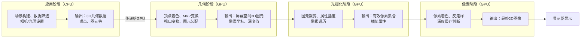

 # 光栅化与深度缓存（Z\-buffer）详细总结（含MVP/视口变换、反走样）

光栅化是计算机图形学中连接“3D几何”与“2D屏幕像素”的核心环节，而渲染管线是实现这一过程的完整流程框架，核心作用是将3D场景逐步转换为2D屏幕图像。以下先梳理渲染管线完整知识点及流程图，再依次展开核心变换、光栅化流程、深度缓存原理、反走样等关键内容，完整覆盖整个渲染逻辑。

## 一、渲染管线（Rendering Pipeline）完整知识点

 

    <image src='imgs/list.png' width=80% />
 

---

渲染管线是将3D场景（几何数据、材质、光照等）转换为2D屏幕图像的一系列有序处理步骤，分为“应用阶段→几何阶段→光栅化阶段→像素阶段”四个核心阶段，各阶段依次执行、紧密衔接，每个阶段均有明确的输入输出和核心任务，最终实现从3D到2D的可视化转换。

### 1\. 渲染管线核心阶段详解

渲染管线的四个核心阶段，每个阶段又包含若干子步骤，各阶段的输入、输出及核心作用如下，确保与后续MVP变换、光栅化、深度缓存等知识点精准衔接：

#### （1）应用阶段（Application Stage）

核心定位：由CPU负责，是渲染管线的起始阶段，主要完成“场景准备”和“几何数据输出”，为后续阶段提供基础数据。

核心任务：

- 场景构建：加载3D模型（顶点数据、纹理数据、法向量数据等）、设置相机参数（位置、朝向、视野范围）、配置光照（环境光、方向光、点光等）和材质属性。

- 几何数据筛选：剔除场景中完全不可见的物体（如超出相机视野的物体），减少后续计算量。

- 输出：向几何阶段输出经过筛选的3D几何数据（顶点坐标、顶点属性、图元类型等），通常以三角形图元为主要输出单位（三角形是最基础的凸多边形，可无缝拼接复杂模型）。

关键说明：应用阶段是CPU与GPU的交互节点，CPU完成数据准备后，将几何数据传递给GPU，进入后续由GPU并行处理的阶段。

#### （2）几何阶段（Geometry Stage）

核心定位：由GPU负责，核心是“坐标变换”和“图元处理”，将应用阶段输出的3D顶点坐标，逐步映射到屏幕空间，为光栅化提供可离散化的图元。

核心任务（对应后续详细讲解的MVP变换、视口变换）：

- 顶点着色：对每个顶点进行初步处理，计算顶点的法向量、纹理坐标、颜色等属性（部分简单着色可在此阶段完成）。

- MVP变换：依次执行模型变换、视图变换、投影变换，将顶点从局部空间转换到裁剪空间，剔除相机视野外的顶点。

- 视口变换：将裁剪空间经过齐次除法后的归一化设备坐标（NDC），映射到屏幕空间，得到顶点的屏幕像素坐标。

- 图元装配：将经过坐标变换的顶点，按照输入的图元类型（如三角形），装配成完整的3D图元（如三角形图元），并传递给光栅化阶段。

输出：屏幕空间内的3D图元（含顶点屏幕坐标、深度值、顶点属性等）。

#### （3）光栅化阶段（Rasterization Stage）

核心定位：由GPU负责，是连接3D图元与2D像素的关键环节，核心是“离散化”，将几何阶段输出的3D图元，转换为屏幕上的像素点。

核心任务（后续将详细展开）：

- 图元裁剪：剔除超出屏幕范围的图元部分，保留屏幕内的有效图元。

- 顶点属性插值：根据像素在图元内的位置，加权计算每个像素的深度值、颜色、纹理坐标等属性，确保属性平滑过渡。

- 像素遍历：通过扫描线算法等方式，遍历图元覆盖的所有像素，判断像素是否在图元内部，筛选出有效像素。

输出：屏幕上的有效像素集合（含每个像素的坐标、插值后的属性等）。

#### （4）像素阶段（Pixel Stage）

核心定位：由GPU负责，对光栅化阶段输出的有效像素进行最终处理，确定每个像素的最终颜色，并解决遮挡问题，最终输出可显示的图像。

核心任务（后续将详细展开）：

- 像素着色：结合光照模型（如GGX模型、Blinn\-Phong模型），根据像素的插值属性，计算每个像素的最终颜色。

- 反走样：优化像素离散化带来的锯齿、摩尔纹等问题，使图像边缘更平滑。

- 深度缓存（Z\-buffer）判断：通过深度缓存比较每个像素的深度值，解决不同图元的遮挡问题，只显示最靠近相机的像素。

输出：最终的2D屏幕图像（颜色缓存中的像素颜色），传递给显示器显示。

### 渲染管线流程图

以下流程图清晰展示渲染管线四个核心阶段的执行顺序、各阶段核心任务及输入输出，与后续知识点一一对应，直观呈现3D场景到2D图像的完整转换过程：

流程图说明：渲染管线为线性执行流程，前一阶段的输出为后一阶段的输入，CPU负责应用阶段的场景准备，GPU负责后续三个阶段的并行计算，确保渲染效率，最终通过像素阶段的深度缓存和反走样处理，呈现出具有立体感、无遮挡、边缘平滑的2D图像。

### 一、模型变换（Model Transform）的深入解释与几何意义理解

**核心概念回顾：** 模型变换是将物体从它自己独立的“局部空间”（或者叫“模型空间”，就像每个玩具都有自己的小盒子）转换到“世界空间”（一个所有玩具都放在一起的大房间）。这个过程通过平移、旋转、缩放这三种基本操作的组合来实现。

**几何意义理解：** 想象你有一个乐高积木模型。你先在桌子上搭建它（这是在它的“局部空间”里操作）。然后，你想把它放到你的房间（“世界空间”）里的某个位置，比如窗台上，并且让它面向窗外，稍微倾斜一点，可能还要放大一点让它看起来更显眼。这个“放到窗台”、“面向窗外”、“稍微倾斜”、“放大一点”就是模型变换。

**公式推导的深入解析：**

文档中给出了缩放、旋转、平移矩阵的推导，并强调了组合顺序。这里我们更深入地理解这些矩阵的几何意义和它们如何影响顶点。

1.  **齐次坐标的魔力：**
    在3D图形学中，我们通常使用**齐次坐标**来表示顶点，即一个三维点 $(x, y, z)$ 会被表示成四维向量 $(x, y, z, 1)$。为什么要多一个 $w$ 分量呢？
    *   **统一变换：** 最大的好处是，它允许我们将平移、旋转、缩放这些原本不同类型的变换，都用**矩阵乘法**来表示。如果没有齐次坐标，平移操作就不能用简单的矩阵乘法实现，需要额外的向量加法，这会使得渲染管线中的计算变得复杂且不统一。
    *   **透视投影：** 齐次坐标的 $w$ 分量在透视投影中扮演了至关重要的角色，它用于实现“近大远小”的效果，我们会在投影变换中详细讨论。

2.  **缩放矩阵 $S$：**
    $$S = \begin{pmatrix} s_x & 0 & 0 & 0 \\ 0 & s_y & 0 & 0 \\ 0 & 0 & s_z & 0 \\ 0 & 0 & 0 & 1 \end{pmatrix}$$
    *   **几何意义：** 这个矩阵很简单直观，它将顶点的 $x, y, z$ 坐标分别乘以对应的缩放因子 $s_x, s_y, s_z$。
    *   就像你用图片编辑软件调整图片大小一样，你可以单独拉伸宽度、高度或深度。如果 $s_x = s_y = s_z$，那就是等比例缩放。

3.  **旋转矩阵 $R_x, R_y, R_z$：**
    文档中给出了围绕X、Y、Z轴旋转的矩阵。这些矩阵的推导基于**二维旋转公式**的扩展。
    *   **二维旋转回顾：** 在二维平面上，一个点 $(x, y)$ 绕原点逆时针旋转 $\theta$ 角后的新坐标 $(x', y')$ 可以表示为：
        $$x' = x \cos\theta - y \sin\theta$$
        $$y' = x \sin\theta + y \cos\theta$$
        对应的矩阵形式是：
        $\begin{pmatrix} x' \\ y' \end{pmatrix} = \begin{pmatrix} \cos\theta & -\sin\theta \\ \sin\theta & \cos\theta \end{pmatrix} \begin{pmatrix} x \\ y \end{pmatrix}$
    *   **扩展到三维：**
        *   **绕X轴旋转 $R_x$：** 当绕X轴旋转时，X坐标保持不变，Y和Z坐标在YZ平面上进行二维旋转。所以，X轴对应的行和列保持不变，YZ分量应用二维旋转矩阵。
            $$R_x = \begin{pmatrix} 1 & 0 & 0 & 0 \\ 0 & \cos\theta & -\sin\theta & 0 \\ 0 & \sin\theta & \cos\theta & 0 \\ 0 & 0 & 0 & 1 \end{pmatrix}$$
        *   **绕Y轴旋转 $R_y$：** 类似地，绕Y轴旋转时，Y坐标不变，X和Z坐标在XZ平面上旋转。需要注意的是，为了保持右手坐标系，通常将Z轴视为“向上”，X轴视为“向右”，所以旋转方向会有所调整，导致 $\sin\theta$ 的符号变化。
            $$R_y = \begin{pmatrix} \cos\theta & 0 & \sin\theta & 0 \\ 0 & 1 & 0 & 0 \\ -\sin\theta & 0 & \cos\theta & 0 \\ 0 & 0 & 0 & 1 \end{pmatrix}$$
        *   **绕Z轴旋转 $R_z$：** Z坐标不变，X和Y坐标在XY平面上旋转。
            $$R_z = \begin{pmatrix} \cos\theta & -\sin\theta & 0 & 0 \\ \sin\theta & \cos\theta & 0 & 0 \\ 0 & 0 & 1 & 0 \\ 0 & 0 & 0 & 1 \end{pmatrix}$$
    *   **几何意义：** 想象你拿着一个地球仪，绕着它的轴心转动。绕X轴转就是让它“点头”或“仰头”，绕Y轴转就是让它“摇头”，绕Z轴转就是让它“自转”。

4.  **平移矩阵 $T$：**
    $$T = \begin{pmatrix} 1 & 0 & 0 & t_x \\ 0 & 1 & 0 & t_y \\ 0 & 0 & 1 & t_z \\ 0 & 0 & 0 & 1 \end{pmatrix}$$
    *   **几何意义：** 这个矩阵利用齐次坐标的 $w=1$ 特性，将平移量 $t_x, t_y, t_z$ 加到顶点的 $x, y, z$ 分量上。
        $$\begin{pmatrix} x' \\ y' \\ z' \\ 1 \end{pmatrix} = \begin{pmatrix} 1 & 0 & 0 & t_x \\ 0 & 1 & 0 & t_y \\ 0 & 0 & 1 & t_z \\ 0 & 0 & 0 & 1 \end{pmatrix} \begin{pmatrix} x \\ y \\ z \\ 1 \end{pmatrix} = \begin{pmatrix} x + t_x \\ y + t_y \\ z + t_z \\ 1 \end{pmatrix}$$
    *   **几何意义：** 就像你在地图上移动一个标记点，只是简单地把它从一个位置搬到另一个位置，不改变它的方向和大小。

5.  **组合模型变换矩阵 $M = T \cdot R \cdot S$：**
    *   **顺序的重要性：** 文档中强调了“缩放→旋转→平移”的顺序不可颠倒。这是因为矩阵乘法不满足交换律。
        *   **思考：** 如果先平移再缩放，那么平移的距离也会被缩放；如果先旋转再平移，那么平移的方向也会跟着旋转。
        *   **正确理解：** “缩放→旋转→平移”的顺序意味着：
            1.  首先，物体在自己的局部空间（原点）进行缩放。
            2.  然后，在局部空间（原点）进行旋转。
            3.  最后，将已经缩放和旋转好的物体，从局部空间的原点平移到世界空间的指定位置。
    *   **几何意义：** 想象你有一个小模型。
        1.  你先把它**放大**（缩放）。
        2.  然后把它**转个方向**（旋转）。
        3.  最后把它**放到桌子中央**（平移）。
        如果你先把它放到桌子中央，再放大，那么它会以桌子中央为中心放大，而不是以它自身为中心放大。如果你先把它放到桌子中央，再转个方向，那么它会绕着桌子中央转，而不是绕着它自身转。所以，顺序非常重要！

---

### 二、视图变换（View Transform）的深入解释与人性化理解

**核心概念回顾：** 视图变换是将世界空间中的所有物体，转换到“相机空间”（或“视图空间”）。在这个空间里，相机就是世界的中心，它看向的方向是Z轴负方向，X轴向右，Y轴向上。

**几何意义理解：** 想象你是一个摄影师，站在一个大房间（世界空间）里，房间里有很多家具（物体）。你想要给某个家具拍照。视图变换就像是：
1.  你先**走到**一个合适的位置（相机位置）。
2.  然后**转动身体**，让相机镜头对准你想拍的家具（相机朝向）。
3.  最后，你可能还会**调整一下头部的倾斜角度**，确保画面是水平的（相机上方向）。
这个过程，就是把整个房间和家具都“搬”到你的视角里，以你为中心来观察。

**公式推导的深入解析：**

视图变换的本质是构建一个变换矩阵 $V$，它能将世界坐标系下的点 $\mathbf{v}_{world}$ 转换到相机坐标系下的点 $\mathbf{v}_{view}$。
$\mathbf{v}_{view} = V \cdot \mathbf{v}_{world}$

这个 $V$ 矩阵的构建思路是：**将相机从世界空间的原点和标准朝向，移动到它实际的位置和朝向，然后取这个变换的逆矩阵。** 换句话说，我们不是移动相机，而是移动整个世界，让世界相对于相机达到我们想要的效果。

文档中给出的推导方法是“将相机移动到世界空间原点，并调整朝向”。这等价于：

1.  **平移世界：** 将整个世界向相机位置的**反方向**平移，使得相机“回到”世界原点。
    平移矩阵 $T_{view}$：
    $$T_{view} = \begin{pmatrix} 1 & 0 & 0 & -e_x \\ 0 & 1 & 0 & -e_y \\ 0 & 0 & 1 & -e_z \\ 0 & 0 & 0 & 1 \end{pmatrix}$$
    其中 $\mathbf{e} = (e_x, e_y, e_z)$ 是相机在世界空间中的位置。

2.  **旋转世界：** 将整个世界旋转，使得相机的朝向与相机坐标系的Z轴负方向对齐，相机的上方向与相机坐标系的Y轴对齐，相机的右方向与相机坐标系的X轴对齐。
    为了构建这个旋转矩阵 $R_{view}$，我们需要先确定相机坐标系的三个正交基向量：
    *   **相机Z轴 $\mathbf{z}$：** 指向相机后方，与观察方向相反。如果相机看的目标点是 $\mathbf{t}$，相机位置是 $\mathbf{e}$，那么观察方向是 $\mathbf{t} - \mathbf{e}$。所以 $\mathbf{z}$ 向量是 $(\mathbf{e} - \mathbf{t})$ 的单位向量。
        $$\mathbf{z} = \frac{\mathbf{e} - \mathbf{t}}{\vert \mathbf{e} - \mathbf{t} \vert}$$
    *   **相机X轴 $\mathbf{x}$：** 指向相机右方。它必须垂直于相机的上方向 $\mathbf{up}$ 和相机的Z轴 $\mathbf{z}$。通过叉乘可以得到。
        $$\mathbf{x} = \frac{\mathbf{up} \times \mathbf{z}}{\vert \mathbf{up} \times \mathbf{z} \vert}$$
        这里需要注意，$\mathbf{up}$ 向量是世界空间中的一个“向上”的参考向量，它不一定是相机最终的Y轴，只是用来辅助确定相机X轴和Y轴的。
    *   **相机Y轴 $\mathbf{y}$：** 指向相机上方。它必须垂直于相机X轴 $\mathbf{x}$ 和Z轴 $\mathbf{z}$。
        $$\mathbf{y} = \mathbf{z} \times \mathbf{x}$$
        （注意这里是 $\mathbf{z} \times \mathbf{x}$ 而不是 $\mathbf{x} \times \mathbf{z}$，以确保右手坐标系。）

    有了这三个相互垂直的单位向量 $\mathbf{x}, \mathbf{y}, \mathbf{z}$，它们就构成了相机坐标系的基。将世界空间中的点转换到相机空间，实际上就是将世界空间中的点投影到这三个基向量上。这个旋转矩阵 $R_{view}$ 的每一行就是这些基向量的转置：
    $$R_{view} = \begin{pmatrix} x_x & x_y & x_z & 0 \\ y_x & y_y & y_z & 0 \\ z_x & z_y & z_z & 0 \\ 0 & 0 & 0 & 1 \end{pmatrix}$$
    其中 $(x_x, x_y, x_z)$ 是 $\mathbf{x}$ 的分量，以此类推。

	

3.  **组合视图变换矩阵 $V = R_{view} \cdot T_{view}$：
    视图变换顺序为“先平移，后旋转”，因此视图变换矩阵
	$V = R_{view} \cdot T_{view}$。

	最终，世界空间顶点转换为相机空间顶点的详细公式为：

	$\mathbf{v}_{view} = V \cdot \mathbf{v}_{world} = R_{view} \cdot T_{view} \cdot \begin{pmatrix} x_{world} \\ y_{world} \\ z_{world} \\ 1 \end{pmatrix}$

关键作用：将“观察视角”固定，后续所有计算均围绕相机视角展开，模拟人眼观察场景的效果。

*   **顺序：** “先平移，后旋转”。这是因为我们首先将相机（以及整个世界）平移到原点，然后才进行旋转，确保旋转是围绕原点进行的。
*   **几何意义：** 想象你站在房间中央，你先平移到窗边，然后再转头看向窗外。这个平移和旋转是针对你自己的。而视图变换是把整个世界平移和旋转，让你“感觉”回到了原点，并且世界“感觉”正对着你。

---

### 三、投影变换（Projection Transform）的深入解释与人性化理解

**核心概念回顾：** 投影变换是将相机空间中的3D顶点，转换到“裁剪空间”（或“齐次裁剪空间”）。它的主要目的是：
1.  **剔除视野外的物体：** 任何不在相机“视锥体”或“视景体”内的物体都会被裁剪掉。
2.  **为2D投影做准备：** 将3D场景中的物体“压扁”到2D平面上，同时为后续的齐次除法（透视除法）提供 $w$ 分量。

**几何意义：** 想象你正在用一个特殊的相机拍照。
*   **正交投影：** 就像用一个“平行光”相机拍照。无论物体离你多远，它在照片上的大小都一样。这在工程图纸上很常见，因为要保持物体的真实尺寸。
*   **透视投影：** 就像我们日常生活中看到的景象。远处的物体看起来小，近处的物体看起来大，有“近大远小”的透视效果。这是游戏和电影中最常用的方式，因为它更符合人眼的视觉习惯。

**公式推导的深入解析：**

#### 1. 正交投影（Orthographic Projection）

**核心思想：** 将一个长方体（正交视景体）内的所有物体，线性地映射到一个标准的立方体（NDC空间，x, y, z 范围都是 $[-1, 1]$）中。

无近大远小效果，物体大小与距离无关（工程绘图、UI界面常用）。投影矩阵会将相机视野内的顶点，映射到一个长方体（正交视景体）内。

**参数定义：**
*   $l, r, b, t$: 正交视景体的左、右、下、上边界。
*   $n, f$: 正交视景体的近裁剪面和远裁剪面（注意在相机空间中，$z$ 轴是负方向，所以 $n$ 和 $f$ 都是负值，且 $f < n$）。

**推导步骤：**

1.  **平移到中心：** 首先，我们需要将这个长方体的中心平移到原点。长方体的中心坐标是 $(\frac{l+r}{2}, \frac{b+t}{2}, \frac{n+f}{2})$。所以，我们需要向负方向平移这些距离。
    $$T_{ortho} = \begin{pmatrix} 1 & 0 & 0 & -\frac{l+r}{2} \\ 0 & 1 & 0 & -\frac{b+t}{2} \\ 0 & 0 & 1 & -\frac{n+f}{2} \\ 0 & 0 & 0 & 1 \end{pmatrix}$$
    *   **几何意义：** 就像你有一个盒子，你把它搬到房间的正中央。

2.  **缩放到标准尺寸：** 接着，我们需要将这个长方体缩放到边长为2的标准立方体（NDC空间范围是 $[-1, 1]$）。长方体的宽度是 $(r-l)$，高度是 $(t-b)$，深度是 $(n-f)$。为了映射到 $[-1, 1]$，我们需要将宽度缩放 $2/(r-l)$，高度缩放 $2/(t-b)$，深度缩放 $2/(n-f)$。
    $$S_{ortho} = \begin{pmatrix} \frac{2}{r-l} & 0 & 0 & 0 \\ 0 & \frac{2}{t-b} & 0 & 0 \\ 0 & 0 & \frac{2}{n-f} & 0 \\ 0 & 0 & 0 & 1 \end{pmatrix}$$
    *   **人性化：** 你把盒子搬到中央后，再把它拉伸或压缩，让它的尺寸变成一个标准的单位盒子。

3.  **组合正交投影矩阵 $P_{ortho} = S_{ortho} \cdot T_{ortho}$：**
    将这两个矩阵相乘，就得到了最终的正交投影矩阵。
    $$\begin{pmatrix} x_{clip} \\ y_{clip} \\ z_{clip} \\ w_{clip} \end{pmatrix} = \begin{pmatrix} \frac{2}{r-l} & 0 & 0 & -\frac{l+r}{r-l} \\ 0 & \frac{2}{t-b} & 0 & -\frac{b+t}{t-b} \\ 0 & 0 & \frac{2}{n-f} & -\frac{n+f}{n-f} \\ 0 & 0 & 0 & 1 \end{pmatrix} \cdot \begin{pmatrix} x_v \\ y_v \\ z_v \\ 1 \end{pmatrix}$$
    这里 $w_{clip}$ 始终为1，因为正交投影没有透视效果，不需要 $w$ 分量来做透视除法。

#### 2. 透视投影（Perspective Projection）

**核心思想：** 将一个视锥体（金字塔形）内的所有物体，非线性地映射到一个标准的立方体（NDC空间）中，实现“近大远小”的效果。

最贴合人眼视觉，远处物体看起来更小，近大远小效果明显（游戏、影视常用）。投影矩阵会将相机视野内的顶点，映射到一个四棱锥（视锥体）内，超出视锥体的顶点会被后续裁剪步骤剔除。

**参数定义：**
*   $n, f$: 近裁剪面和远裁剪面（同样是负值，且 $f < n$）。
*   $fov_y$: 垂直视场角。
*   $aspect$: 宽高比。
*   $t, b, l, r$: 近裁剪面上的上、下、左、右边界。

**推导步骤：**

透视投影通常分为两步：
1.  **挤压变换（Perspective to Orthographic）：** 将视锥体“挤压”成一个正交视景体。这一步是实现透视效果的关键。
2.  **正交投影：** 对挤压后的正交视景体进行正交投影，将其映射到NDC空间。

**（1）挤压变换矩阵 $M_{persp}$：**
这一步的目的是让远处的物体在 $x, y$ 方向上缩小，同时将 $z$ 值进行非线性变换，使得近处的深度变化更精细，远处的深度变化更粗糙（这对于深度缓存的精度很重要）。

关键的几何观察是：在透视投影中，一个点 $(x_v, y_v, z_v)$ 在近裁剪面上的投影点 $(x_p, y_p)$ 满足相似三角形原理。
如果近裁剪面在 $z=n$ 处，那么：
$$x_p = x_v \cdot \frac{n}{z_v}$$
$$y_p = y_v \cdot \frac{n}{z_v}$$
注意，相机空间中 $z_v$ 是负值，$n$ 也是负值，所以 $n/z_v$ 是一个正数，且当 $|z_v|$ 越大（越远），$n/z_v$ 越小，投影点越靠近中心，体现了“近大远小”。

为了用矩阵乘法实现这种除法，我们需要利用齐次坐标的 $w$ 分量。我们希望最终的 $w_{clip}$ 等于 $-z_v$（或者 $z_v$，取决于坐标系定义）。
所以，我们构造一个矩阵，使得：
*   $x_{clip} = n \cdot x_v$
*   $y_{clip} = n \cdot y_v$
*   $z_{clip}$ 需要一个复杂的非线性变换，以保证深度精度。
*   $w_{clip} = -z_v$

这个挤压变换矩阵 $M_{persp}$ 如下：
$$M_{persp} = \begin{pmatrix} n & 0 & 0 & 0 \\ 0 & n & 0 & 0 \\ 0 & 0 & n+f & -n \cdot f \\ 0 & 0 & 1 & 0 \end{pmatrix}$$
让我们验证一下它如何作用于一个相机空间顶点 $\mathbf{v}_{view} = (x_v, y_v, z_v, 1)$：
$$\begin{pmatrix} x' \\ y' \\ z' \\ w' \end{pmatrix} = \begin{pmatrix} n & 0 & 0 & 0 \\ 0 & n & 0 & 0 \\ 0 & 0 & n+f & -n \cdot f \\ 0 & 0 & 1 & 0 \end{pmatrix} \begin{pmatrix} x_v \\ y_v \\ z_v \\ 1 \end{pmatrix} = \begin{pmatrix} n \cdot x_v \\ n \cdot y_v \\ (n+f)z_v - n \cdot f \\ z_v \end{pmatrix}$$
现在，我们得到了一个齐次坐标 $(n \cdot x_v, n \cdot y_v, (n+f)z_v - n \cdot f, z_v)$。
在后续的齐次除法中，我们会将 $x', y', z'$ 分别除以 $w'$，即 $z_v$。
*   $x_{ndc} = \frac{n \cdot x_v}{z_v}$
*   $y_{ndc} = \frac{n \cdot y_v}{z_v}$
这正是我们想要的透视投影效果！

**（2）正交投影矩阵 $P_{ortho}$：**
挤压变换后，我们的视锥体变成了一个新的正交视景体。这个新的正交视景体的边界是：
*   左边界 $l' = -r$
*   右边界 $r' = r$
*   下边界 $b' = -t$
*   上边界 $t' = t$
*   近裁剪面 $n' = n$
*   远裁剪面 $f' = f$
其中 $r$ 和 $t$ 是近裁剪面上的半宽度和半高度，由 $fov_y$ 和 $aspect$ 计算得到：
$t = |n| \cdot \tan(\frac{fov_y}{2})$
$r = t \cdot aspect$

然后，我们就可以使用之前推导的正交投影矩阵 $P_{ortho}$，将这个新的正交视景体映射到NDC空间。

**（3）组合透视投影矩阵 $P_{persp} = P_{ortho} \cdot M_{persp}$：**
将挤压变换矩阵和正交投影矩阵相乘，就得到了最终的透视投影矩阵。文档中给出的最终展开形式就是这两个矩阵相乘的结果。

**关键作用：**
*   **裁剪：** 投影变换后的裁剪空间，其 $x, y, z$ 分量都在 $[-w, w]$ 范围内。任何超出这个范围的顶点都会被裁剪掉，确保只有相机视野内的物体才会被渲染。
*   **透视除法准备：** $w$ 分量被巧妙地设置为 $-z_v$，为后续的齐次除法（透视除法）做准备，从而实现“近大远小”的透视效果。

---

### 四、视口变换（Viewport Transform）的深入解释与人性化理解

**核心概念回顾：** 视口变换是MVP变换的最后一步，它将“裁剪空间”经过“齐次除法”后的“归一化设备坐标（NDC）”映射到最终的“屏幕空间”（即显示器的像素坐标）。

**几何意义理解：** 想象你已经拍好了一张照片（NDC空间），这张照片的尺寸是标准的 $[-1, 1]$。现在你需要把这张照片打印出来，打印到一张实际的纸上（屏幕空间）。
1.  **齐次除法：** 就像你把照片从相机里拿出来，它就从一个“抽象”的格式变成了“实际”的图像。
2.  **视口映射：** 就像你把这张照片放到打印机里，告诉打印机：“我要把这张照片打印到这张纸的左上角开始，宽度是1920像素，高度是1080像素。”

**公式推导的深入解析：**

#### 1. 齐次除法（裁剪空间 → NDC）

**核心原理：** 裁剪空间中的顶点是齐次坐标 $(x_{clip}, y_{clip}, z_{clip}, w_{clip})$。齐次除法的目的就是将 $x, y, z$ 分量都除以 $w$ 分量，从而得到非齐次坐标，也就是归一化设备坐标（NDC）。

**详细公式：**
$$x_{ndc} = \frac{x_{clip}}{w_{clip}}$$
$$y_{ndc} = \frac{y_{clip}}{w_{clip}}$$
$$z_{ndc} = \frac{z_{clip}}{w_{clip}}$$

**推导说明：**
*   **透视除法：** 在透视投影中，$w_{clip}$ 实际上是相机空间中的 $-z_v$（或 $z_v$）。所以，齐次除法就是将 $x_v, y_v$ 除以 $z_v$，这正是实现透视效果的关键。
*   **NDC范围：** 经过裁剪和齐次除法后，NDC的 $x, y, z$ 分量都将落在 $[-1, 1]$ 的范围内。
    *   $x_{ndc} \in [-1, 1]$：屏幕的左边界是 -1，右边界是 1。
    *   $y_{ndc} \in [-1, 1]$：屏幕的下边界是 -1，上边界是 1。
    *   $z_{ndc} \in [-1, 1]$：深度值，-1 代表最近，1 代表最远。这个深度值非常重要，它会被写入深度缓存。

#### 2. 视口映射（NDC → 屏幕空间）

**核心原理：** 将NDC的 $[-1, 1]$ 范围映射到实际的屏幕像素坐标范围。屏幕像素坐标通常以左上角为 $(0, 0)$，X轴向右，Y轴向下。

**定义屏幕参数：**
*   $width$: 屏幕的宽度（像素数）。
*   $height$: 屏幕的高度（像素数）。

**推导步骤：**

1.  **NDC $[-1, 1]$ 映射到 $[0, 1]$：**
    首先，将NDC的 $[-1, 1]$ 范围线性映射到 $[0, 1]$ 范围。
    $$x_{norm} = \frac{x_{ndc} + 1}{2}$$
    $$y_{norm} = \frac{y_{ndc} + 1}{2}$$
    *   **人性化：** 就像你把一个从 -1 到 1 的刻度尺，变成一个从 0 到 1 的百分比刻度尺。

2.  **$[0, 1]$ 映射到屏幕像素坐标：**
    *   **X方向：** 屏幕的X坐标范围是 $[0, width-1]$。
        $$x_{screen} = x_{norm} \times (width - 1)$$
        （注意这里是 `width - 1`，因为像素索引从0开始）。
    *   **Y方向：** 这里有一个重要的细节：NDC的Y轴通常是向上的，而屏幕像素的Y轴通常是向下的。所以我们需要翻转Y轴。
        $$y_{screen} = (1 - y_{norm}) \times (height - 1)$$
    *   **为什么是 $1 - y_{norm}$？** 如果 $y_{ndc} = 1$（NDC最上方），那么 $y_{norm} = 1$。经过 $1 - y_{norm}$ 后变成 0，对应屏幕最上方。如果 $y_{ndc} = -1$（NDC最下方），那么 $y_{norm} = 0$。经过 $1 - y_{norm}$ 后变成 1，对应屏幕最下方。这样就实现了Y轴的翻转。

3.  **组合视口映射完整公式：**
    将上述两步结合起来，得到最终的屏幕像素坐标：
    $$x_{screen} = \frac{x_{ndc} + 1}{2} \times (width - 1)$$
    $$y_{screen} = \frac{1 - y_{ndc}}{2} \times (height - 1)$$

**最终结果：** 屏幕空间像素坐标 $(x_{screen}, y_{screen})$，以及 NDC 中的 $z_{ndc}$ 作为深度值。这些信息将传递给光栅化阶段。

---
## 光栅化核心流程（光栅化阶段详细内容）

### 五、图元裁剪（Clip）

核心原理：经过投影变换和视口变换后，仍可能存在部分图元超出屏幕范围（即像素坐标超出$x \in [0, width-1]$、$y \in [0, height-1]$），或部分顶点在相机视野外（裁剪空间中未通过齐次裁剪测试），因此需对图元进行裁剪，只保留屏幕范围内的部分，剔除超出范围的部分，避免无效计算。

关键操作：采用“Sutherland\-Hodgman算法”（针对凸多边形裁剪），以屏幕边界（左、右、上、下）为裁剪平面，逐边对三角形图元进行裁剪。若三角形完全在屏幕内，则直接保留；若完全在屏幕外，则直接剔除；若部分在屏幕内，则裁剪后生成新的三角形（或线段），确保裁剪后的图元完全位于屏幕范围内。

补充说明：裁剪过程中，不仅要裁剪顶点的屏幕坐标，还需同步裁剪顶点对应的深度值$z_{ndc}$、纹理坐标、法向量等附属信息，为后续插值做准备。

### 六、顶点属性插值（Interpolation）的深入解释与几何意义理解

**核心概念回顾：** 当一个3D三角形被光栅化成2D屏幕上的像素时，每个像素的颜色、深度、纹理坐标等属性，并不是直接取自三角形的某个顶点，而是根据像素在三角形内部的位置，通过“重心坐标插值”计算出来的。这确保了属性在三角形表面上的平滑过渡。

**几何意义理解** 想象你有一块三角形的布料，它的三个角分别染成了红、绿、蓝三种颜色。你用剪刀剪下布料中间的一小块（一个像素）。这小块布料的颜色既不是纯红，也不是纯绿，也不是纯蓝，而是红、绿、蓝三种颜色的混合。混合的比例取决于这小块布料离哪个角更近。离红色角近，红色成分就多；离绿色角近，绿色成分就多。这个混合的比例，就是重心坐标。

**公式推导的深入解析（重心坐标插值）：**

重心坐标是一种非常优雅的插值方法，它基于三角形的面积比。

**参数定义：**
*   三角形的三个顶点：$V_0(x_0, y_0)$、$V_1(x_1, y_1)$、$V_2(x_2, y_2)$。
*   屏幕内的任意像素点：$P(x, y)$。
*   像素点 $P$ 在三角形内的重心坐标：$(u, v, w)$。

**核心性质：**
*   $u + v + w = 1$
*   $u \ge 0, v \ge 0, w \ge 0$ (如果任何一个小于0，说明点 $P$ 在三角形外部)

**重心坐标 $(u, v, w)$ 的推导：**

重心坐标 $u, v, w$ 可以理解为点 $P$ 对顶点 $V_0, V_1, V_2$ 的“权重”。
*   $u$ 是点 $P$ 对 $V_0$ 的权重。
*   $v$ 是点 $P$ 对 $V_1$ 的权重。
*   $w$ 是点 $P$ 对 $V_2$ 的权重。

它们可以通过面积比来计算：

*   $u = \frac{\text{Area}(P V_1 V_2)}{\text{Area}(V_0 V_1 V_2)}$

*   $v = \frac{\text{Area}(P V_0 V_2)}{\text{Area}(V_0 V_1 V_2)}$

*   $w = \frac{\text{Area}(P V_0 V_1)}{\text{Area}(V_0 V_1 V_2)}$

**三角形面积的计算：**
给定三个点 $(x_a, y_a)$, $(x_b, y_b)$, $(x_c, y_c)$，它们的有向面积可以通过叉积的二维形式计算：
$$\text{Area}(A, B, C) = \frac{1}{2} ((x_b - x_a)(y_c - y_a) - (x_c - x_a)(y_b - y_a))$$
文档中给出的面积公式是取了绝对值，因为这里我们只关心面积大小。

所以，
*   **三角形 $V_0 V_1 V_2$ 的面积 $A$：**
    $$A = \frac{1}{2} \vert (x_1 - x_0)(y_2 - y_0) - (y_1 - y_0)(x_2 - x_0) \vert$$
*   **子三角形 $P V_1 V_2$ 的面积 $A_0$：**
    $$A_0 = \frac{1}{2} \vert (x_1 - x)(y_2 - y) - (y_1 - y)(x_2 - x) \vert$$
*   **子三角形 $P V_0 V_2$ 的面积 $A_1$：**
    $$A_1 = \frac{1}{2} \vert (x_0 - x)(y_2 - y) - (y_0 - y)(x_2 - x) \vert$$
*   **子三角形 $P V_0 V_1$ 的面积 $A_2$：**
    $$A_2 = \frac{1}{2} \vert (x_0 - x)(y_1 - y) - (y_0 - y)(x_1 - x) \vert$$

**重心坐标：**
$$u = \frac{A_0}{A}, \quad v = \frac{A_1}{A}, \quad w = \frac{A_2}{A}$$

**属性插值：**
一旦我们计算出像素 $P$ 的重心坐标 $(u, v, w)$，就可以用它们来插值任何顶点属性。
例如，如果我们要插值深度值 $z$：
$$z_P = u \cdot z_0 + v \cdot z_1 + w \cdot z_2$$
其中 $z_0, z_1, z_2$ 分别是顶点 $V_0, V_1, V_2$ 的深度值。
同理，颜色、纹理坐标、法向量等属性，都可以用这个公式进行插值。

**为什么重心坐标插值是线性的？**
重心坐标插值是线性的，这意味着它在三角形内部提供了一个平滑的、连续的属性变化。这对于渲染出真实感强的图像至关重要。例如，如果颜色不是线性插值的，三角形内部可能会出现突兀的颜色变化。

**透视校正插值：**
需要注意的是，对于透视投影后的属性（如纹理坐标、法向量），直接在屏幕空间进行线性插值会导致透视失真。为了得到正确的透视效果，需要进行**透视校正插值**。
其基本思想是：在相机空间中，属性是线性的，但经过透视投影后，在屏幕空间就不是线性的了。为了解决这个问题，我们通常插值属性除以 $w$（相机空间深度）的值，然后在像素着色阶段再乘以 $w$。
例如，对于纹理坐标 $T_0, T_1, T_2$：
1.  计算 $T_0/z_0, T_1/z_1, T_2/z_2$。
2.  在屏幕空间使用重心坐标插值这些值：$(T/z)_P = u \cdot (T_0/z_0) + v \cdot (T_1/z_1) + w \cdot (T_2/z_2)$。
3.  同时，插值 $1/z$：$(1/z)_P = u \cdot (1/z_0) + v \cdot (1/z_1) + w \cdot (1/z_2)$。
4.  最终的纹理坐标 $T_P = (T/z)_P / (1/z)_P$。
这种方法确保了属性在透视投影下的正确性。

### 七，像素遍历（扫描线算法）

核心原理：完成顶点属性插值后，需遍历三角形图元在屏幕上覆盖的所有像素，判断每个像素是否在三角形内部（通过重心坐标判断），若在内部，则记录该像素的坐标及插值后的各项属性，为后续着色和深度判断做准备。

关键操作（扫描线算法步骤）：

1. 确定三角形在屏幕上的纵向范围（y轴最小值$y_{min}$到最大值$y_{max}$），逐行（扫描线）遍历y从$y_{min}$到$y_{max}$的所有像素行。

2. 对每一行y，计算该扫描线与三角形两条边的交点x坐标（$x_{left}$和$x_{right}$），得到该扫描线上属于三角形的x范围$[x_{left}, x_{right}]$。

3. 遍历该扫描线上x从$x_{left}$到$x_{right}$的所有像素，通过重心坐标判断该像素是否在三角形内部，若在，则计算该像素的插值属性（深度、颜色等）。

补充说明：扫描线算法是光栅化最常用的像素遍历方法，其核心优势是高效、易实现，可快速定位三角形覆盖的所有像素，减少无效计算；同时可结合增量计算，优化交点x坐标和重心坐标的计算速度，提升光栅化效率。

### 八， 像素着色（Shading）

核心原理：为每个位于三角形内部的像素，根据插值得到的属性（法向量、纹理坐标、深度等），结合光照模型（如前面提到的GGX模型、Blinn\-Phong模型），计算该像素的最终颜色值。着色是决定图像视觉效果的关键步骤，直接影响画面的真实感。

关键操作：根据场景的光照条件（环境光、方向光、点光等），结合像素的法向量、纹理坐标等属性，执行光照计算。例如，通过法向量与光线方向的点积，计算漫反射颜色；通过GGX模型的D/F/G三项，计算镜面反射颜色；最终将漫反射、镜面反射、环境光等颜色叠加，得到像素的最终颜色。

补充说明：着色过程可在“顶点着色器”或“片段着色器”中完成（图形管线中的两个核心着色阶段）：顶点着色器针对顶点进行初步着色，再通过插值得到像素着色所需的属性；片段着色器则直接针对每个像素进行精细化着色，效果更真实，是现代图形学中最常用的着色方式。

---

### 九、深度缓存（Z-buffer）的工作流程与几何意义理解

**核心概念回顾：** 深度缓存（Z-buffer）是3D渲染中解决物体遮挡问题的核心技术。它是一块与屏幕分辨率对应的内存区域，记录了每个像素当前“最近”的深度值。通过比较新像素的深度值和缓存中的深度值，来决定哪个像素应该被显示。

当3D场景中存在多个物体时，不同物体的图元可能会在屏幕上覆盖同一个像素，此时需要判断哪个图元的像素更靠近相机（深度更小），只显示靠近相机的像素，隐藏被遮挡的像素，这个判断过程就由深度缓存（Z\-buffer）完成。深度缓存是一块与屏幕分辨率完全对应的内存区域，核心作用是“记录每个像素的当前最小深度值”，通过逐像素的深度比较，解决3D场景中的遮挡问题，确保渲染结果的立体感和正确性。

**几何意义理解：** 想象你正在画一幅画，画的是一个复杂的场景，有远处的山，近处的树，还有更近的人物。
*   **深度缓存就像你的“记忆板”：** 这块板子和你画的画布一样大，每个位置都对应画布上的一个点。
*   **记录“最近”：** 当你画山的时候，你在记忆板上记录下山的“远近”（深度）。当你画树的时候，你发现树比山近，所以你擦掉记忆板上山的深度，记录下树的深度，并在画布上画上树。当你画人物的时候，你发现人物比树更近，所以你再次更新记忆板，并画上人物。
*   **“只画最近的”：** 这样，最终你画完的画，远处的山被近处的树遮挡，近处的树又被更近的人物遮挡，画面就有了真实的立体感。

**公式说明的深入解析：**

文档中给出的深度比较核心逻辑是：
$$\text{if } z_{pixel} < z_{buffer} \implies z_{buffer} = z_{pixel}, \ color_{buffer} = color_{pixel}$$

这里我们深入理解其中的细节：

1.  **$z_{pixel}$：当前像素的深度值**
    *   这个深度值是在光栅化阶段，通过顶点属性插值得到的。它代表了当前正在处理的三角形在当前像素位置的深度。
    *   通常，这个 $z_{pixel}$ 是归一化设备坐标（NDC）中的 $z$ 值，范围是 $[-1, 1]$。在实际硬件中，它可能被映射到 $[0, 1]$ 范围，其中 0 代表最近，1 代表最远。

2.  **$z_{buffer}$：深度缓存中存储的深度值**
    *   这是在当前像素位置，目前为止已经渲染过的所有物体中，“最靠近相机”的那个物体的深度值。
    *   在渲染开始时，深度缓存会被初始化为“最大深度值”（例如 NDC 中的 1，或者映射后的 1），表示所有像素都还没有被任何物体覆盖。

3.  **深度比较 $z_{pixel} < z_{buffer}$：**
    *   **“越小越近”：** 这里的比较逻辑是基于“深度值越小，物体越靠近相机”的约定。
    *   **判断：** 如果当前像素的深度值 $z_{pixel}$ 比深度缓存中记录的 $z_{buffer}$ 更小，这意味着当前像素比之前在该位置渲染的任何物体都更靠近相机。

4.  **更新深度缓存和颜色缓存：**
    *   **$z_{buffer} = z_{pixel}$：** 如果当前像素更近，那么深度缓存中该位置的深度值需要更新为当前像素的深度值。
    *   **$color_{buffer} = color_{pixel}$：** 同时，颜色缓存中该位置的颜色也需要更新为当前像素的颜色。这个颜色是像素着色阶段计算出来的。

5.  **丢弃像素：**
    *   如果 $z_{pixel} \ge z_{buffer}$，这意味着当前像素被一个更靠近相机的物体遮挡了。在这种情况下，当前像素的着色结果会被直接丢弃，不写入颜色缓存，也不更新深度缓存。这大大节省了计算资源，因为被遮挡的像素无需进行复杂的着色计算。

**深度值范围与映射的深入理解：**

文档中提到了NDC中的 $z_{ndc}$ 范围是 $[-1, 1]$，但实际存储通常映射到 $[0, 1]$。

**映射公式：**
$$z_{buffer} = \frac{z_{ndc} + 1}{2}$$

**为什么需要映射？**
*   **硬件兼容性：** 大多数图形硬件的深度缓存使用无符号整数来存储深度值。将 $z_{ndc}$ 从 $[-1, 1]$ 映射到 $[0, 1]$ 使得它能够直接对应无符号整数的存储范围（例如，16位无符号整数可以表示 $0$ 到 $65535$）。
*   **精度问题：** 虽然是线性映射，但这个映射本身不会改变深度值的相对顺序。然而，**透视投影本身会导致深度值的非线性分布**。在相机空间中，近处的深度变化很小，远处的深度变化很大。这意味着在NDC空间中，近处的 $z_{ndc}$ 值会非常密集，而远处的 $z_{ndc}$ 值会非常稀疏。
    *   **人性化：** 想象你有一把尺子，近处刻度非常密，远处刻度非常疏。如果你用这把尺子去测量两个非常远的物体，它们可能落在同一个刻度上，你就无法区分它们了。
    *   **影响：** 这种非线性分布是导致“深度冲突”（Z-fighting）的主要原因之一。

---

### 十、深度冲突（Z-fighting）及解决方法的深入解释

**核心概念回顾：** 深度冲突是指当两个或多个物体的深度值非常接近，以至于深度缓存无法精确区分它们时，导致画面出现闪烁、重叠或边缘错位等视觉伪影。

**几何意义理解：** 想象你和你的朋友都站在一条线上，你们俩离你都很近，几乎是并排站着。你用一把不太精确的尺子去测量你们俩的距离。结果尺子显示你们俩的距离完全一样！这时，你就无法判断到底谁在你前面，谁在你后面了。在画画的时候，你可能一会儿画你，一会儿画你朋友，导致画面不断闪烁。这就是深度冲突。

**核心原因的深入解析：**

1.  **深度缓存精度有限：**
    *   深度缓存的存储空间是有限的（例如16位、24位或32位）。这意味着它只能表示有限数量的离散深度值。
    *   如果两个物体的实际深度值差异小于深度缓存能够区分的最小单位（即精度阈值），那么它们在深度缓存中就会被认为是相同的深度。
    *   **举例：** 16位深度缓存只能表示 $2^{16} = 65536$ 个不同的深度值。如果你的场景深度范围很大（从几厘米到几公里），那么每个深度单位代表的实际距离就会很大，导致精度不足。

2.  **透视投影的非线性深度：**
    *   正如前面提到的，透视投影会导致NDC空间中的深度值非线性分布。近处的深度值非常密集，远处的深度值非常稀疏。
    *   这意味着，在远距离处，即使两个物体在实际世界中相距较远，它们在NDC空间中的深度值也可能非常接近，从而更容易发生深度冲突。

**常用解决方法的深入解析：**

1.  **提高深度缓存精度：**
    *   **原理：** 从16位升级到24位或32位深度缓存，可以显著增加可表示的深度值数量（24位有 $2^{24} \approx 1600$ 万个深度值，32位有 $2^{32} \approx 40$ 亿个深度值）。这使得深度缓存能够区分更小的深度差异，从而减少深度冲突。
    *   **代价：** 更高的精度意味着更大的内存占用和潜在的性能开销。

2.  **增加图元间距：**
    *   **原理：** 这是最直接的方法。如果两个物体在场景中确实需要区分前后，就让它们在3D空间中保持足够的距离，确保它们的深度差异大于深度缓存的精度阈值。
    *   **局限性：** 在某些情况下，例如两个平面紧密贴合（如墙壁上的贴花），或者模型细节非常复杂时，很难手动调整间距。

3.  **启用深度偏移（Depth Bias）：**
    *   **原理：** 深度偏移是一种在渲染时人为地给特定图元（通常是容易发生冲突的图元，如贴花、地面上的纹理）的深度值增加一个微小偏移量的方法。
    *   **公式：** $z_{offset} = z_{pixel} + bias$
        *   `bias` 是一个微小的正数。通过增加 `bias`，使得这些图元在深度比较时“稍微远离”相机，从而避免与更靠近相机的图元发生冲突。
        *   通常，`bias` 还会结合一个斜率因子（`slope-scaled bias`），使得偏移量与图元表面的倾斜角度有关。倾斜的表面在屏幕上深度变化更快，更容易出现冲突，因此需要更大的偏移。
    *   **人性化：** 就像你和朋友并排站着，你悄悄地往后退了一小步，这样尺子就能清楚地测量出你朋友在你前面了。
    *   **注意事项：** `bias` 值需要仔细调整，过大会导致物体明显“浮空”，过小则无效。

4.  **调整相机参数（近远裁剪面）：**
    *   **原理：** 深度值的精度在近裁剪面附近最高，在远裁剪面附近最低。这是因为透视投影的非线性深度分布。
    *   **优化：** 适当缩小相机的远裁剪面距离，可以有效地“压缩”深度范围，从而提高整个深度范围内的精度，尤其是在远距离处。
    *   **代价：** 远裁剪面过近会导致远处的物体被裁剪掉，影响场景的完整性。需要在效果和精度之间找到平衡。

---

### 十一、反走样（Anti-Aliasing）的深入解释与几何意义理解

**核心概念回顾：** 反走样是为了解决光栅化过程中由于将连续的3D图元离散化为像素而产生的“走样”现象（如锯齿、摩尔纹、闪烁）。它通过各种技术使图像边缘更平滑，减少视觉失真。

**人性化理解：** 想象你用一个非常低分辨率的打印机打印一张曲线图。打印出来的曲线边缘会是锯齿状的，因为打印机只能用方块像素来近似曲线。反走样就像是：
*   **超采样（SSAA）：** 你用一个分辨率高得多的打印机打印这张曲线图，然后把打印出来的图缩小到你想要的尺寸。这样，原来锯齿状的边缘就变得平滑了。
*   **多重采样（MSAA）：** 你还是用原来的打印机，但这次打印机更聪明了。它会检查曲线边缘附近的每个像素，看看曲线覆盖了像素的多少面积。如果覆盖了一半，它就用一半的曲线颜色和一半的背景颜色来填充这个像素，而不是简单地决定“画”还是“不画”。
*   **快速近似反走样（FXAA）：** 你打印完曲线图后，发现边缘有锯齿。你拿出橡皮擦，沿着锯齿边缘轻轻擦拭，让边缘变得模糊一点，看起来就不那么刺眼了。

**走样产生的根本原因的深入解析：**

1.  **采样不足（Undersampling）：**
    *   像素是离散的采样点。当一个连续的几何图形（如一条线、一个三角形边缘）在屏幕上投影时，如果它的细节变化频率高于像素的采样频率，就会出现走样。
    *   **锯齿（Jaggies）：** 当几何边缘与像素网格不完全对齐时，像素只能粗略地近似边缘，形成阶梯状的锯齿。这是因为每个像素只能显示一种颜色，它无法表示“部分覆盖”。
    *   **摩尔纹（Moiré Patterns）：** 当场景中存在高频细节（如细密的网格、重复的纹理）时，如果采样频率不足，这些细节可能会在屏幕上产生奇怪的、不自然的干涉图案。
    *   **闪烁（Shimmering/Temporal Aliasing）：** 当物体移动时，由于采样点位置的变化，高频细节可能会在帧与帧之间跳动或闪烁。

**常用反走样方法（详细原理）：**

#### 1. 超采样反走样（SSAA，Super Sampling Anti-Aliasing）

**核心原理：**
SSAA是最直接、效果最好的反走样方法，但也是性能开销最大的。它通过在每个像素内部进行多次“子采样”，然后将这些子采样点的颜色平均，来模拟像素被几何边缘部分覆盖的效果。

**关键步骤：**
1.  **提高采样频率：** 将每个屏幕像素在逻辑上划分为 $N \times N$ 个更小的“子采样点”（例如 2x2 意味着每个像素有4个子采样点）。
2.  **对每个子采样点进行渲染：** 对于每个子采样点，都像一个独立的像素一样进行几何测试（判断是否在三角形内部）、深度测试和像素着色。这意味着渲染管线的大部分工作量都增加了 $N \times N$ 倍。
3.  **平均颜色：** 将一个像素内所有子采样点的颜色进行平均，得到该像素的最终颜色。

**优势：**
*   反走样效果极佳，能有效消除锯齿和摩尔纹。
*   理论上可以消除所有类型的走样。

**劣势：**
*   **性能开销巨大：** 渲染管线中的大部分计算（几何、着色、深度测试）都需要执行 $N \times N$ 倍，导致帧率急剧下降。在实时渲染中很少直接使用。

#### 2. 多重采样反走样（MSAA，Multi-Sampling Anti-Aliasing）

**核心原理：**
MSAA是SSAA的一种优化，旨在减少性能开销，同时保持良好的反走样效果。它利用了一个观察：**走样主要发生在几何边缘，而像素内部的颜色通常是平滑变化的。** 因此，MSAA只对“几何覆盖信息”（即哪些子采样点被几何体覆盖）进行多次采样，而像素着色计算只执行一次。

**关键区别与步骤：**
1.  **几何覆盖采样：** 每个像素仍然有多个子采样点。但MSAA只在光栅化阶段，对每个子采样点进行**几何覆盖测试**和**深度测试**。它会记录每个子采样点是否被当前三角形覆盖，以及它的深度值。
2.  **单次像素着色：** 对于一个像素，无论它有多少个子采样点被覆盖，**像素着色器只运行一次**（通常在像素的中心位置）。
3.  **颜色混合：** 在像素着色完成后，MSAA会根据子采样点的覆盖情况，将着色结果与背景颜色进行加权平均。
    *   **公式说明（以2×2 MSAA为例）：** 设像素内4个子采样点中，有 $k$ 个在三角形内部。
        $$color_{final} = \frac{k}{4} \cdot color_{pixel} + \frac{4 - k}{4} \cdot color_{background}$$
        其中 $color_{pixel}$ 是像素中心着色得到的颜色，$color_{background}$ 是背景颜色。
    *   **人性化：** 就像打印机只计算一次墨水颜色，但它会根据曲线覆盖像素的比例，来决定用多少墨水颜色和多少纸张颜色来填充这个像素。

**优势：**
*   反走样效果良好，显著减少锯齿。
*   性能开销远低于SSAA，因为像素着色只执行一次。
*   是实时渲染（如游戏）中最常用的反走样方法。

**劣势：**
*   无法解决纹理走样（摩尔纹），因为纹理采样只进行一次。
*   对透明物体的反走样效果不佳。

#### 3. 快速近似反走样（FXAA，Fast Approximate Anti-Aliasing）

**核心原理：**
FXAA是一种**后处理**反走样技术。它不修改渲染管线中的几何或着色阶段，而是在整个场景渲染完成后，将渲染结果作为一张2D图像，然后对这张图像进行分析，识别出锯齿边缘，并对这些边缘进行模糊处理。

**关键步骤：**
1.  **渲染场景：** 正常渲染场景，不进行任何多重采样。
2.  **边缘检测：** FXAA算法会遍历图像中的每个像素，通过分析像素及其周围像素的亮度或颜色差异，来检测出潜在的几何边缘。
3.  **边缘模糊：** 一旦检测到边缘，FXAA会对边缘上的像素进行局部模糊或混合，从而平滑锯齿。

**优势：**
*   **性能开销极低：** 作为一个后处理效果，它只对最终的2D图像进行操作，与场景的复杂度和几何体的数量无关。
*   **兼容性好：** 适用于任何渲染管线，包括那些不支持MSAA的硬件或API。
*   可以处理所有类型的走样，包括几何走样和纹理走样（尽管效果可能不如SSAA）。

**劣势：**
*   **效果不如MSAA/SSAA：** 由于是后处理，它无法获取到原始的几何信息，只能根据像素颜色来推断边缘，因此可能会导致边缘过度模糊，或者在某些情况下无法完全消除锯齿。
*   可能会模糊一些不应该模糊的细节。

#### 4. 深度缓存的优化技巧（提升渲染效率）

深度缓存的判断过程会占用一定的GPU资源，尤其是屏幕分辨率较高（如4K）时，优化深度缓存的执行效率，能显著提升整体渲染帧率，常用优化方法如下：

- **Early\-Z测试（提前深度测试）**：在像素着色之前执行深度测试，若当前像素的深度值大于深度缓存中的最小深度值，直接丢弃该像素，无需执行后续的像素着色计算，大幅减少无效的着色操作（着色是GPU的主要计算开销之一）。

- **Z\-culling（深度剔除）**：在几何阶段，对完全位于相机远裁剪面之后、或被其他物体完全遮挡的图元，提前剔除，不进入光栅化和深度测试阶段，减少后续计算量。

- **使用深度纹理（Depth Texture）**：将深度缓存的结果保存为深度纹理，后续渲染（如阴影映射、反射效果）可直接复用深度纹理中的深度值，无需重复执行深度测试，提升渲染效率。

- **降低深度缓存精度（按需选择）**：若场景对深度精度要求不高（如2D UI、简单3D场景），可使用16位深度缓存，减少GPU的内存占用和读写开销；复杂3D场景（如3A游戏）则选择24位或32位精度。

#### 5\. 深度缓存的应用场景

深度缓存是3D渲染中解决遮挡问题的核心技术，几乎所有3D渲染场景都离不开深度缓存，典型应用包括：

- **3D游戏渲染：** 解决游戏中不同物体、场景元素的遮挡问题，确保远处的物体被近处的物体遮挡，呈现真实的3D层次感。

- **影视特效渲染：** 在影视级3D渲染中，结合高精度深度缓存，解决复杂场景（如大量角色、场景道具）的遮挡问题，提升画面真实感。

- **建筑可视化：** 在建筑渲染中，确保建筑的墙体、门窗、家具等元素的遮挡关系正确，呈现符合现实的建筑效果。

- **VR/AR渲染：** 在VR/AR场景中，快速执行深度测试，确保虚拟物体与现实场景的遮挡关系合理，提升沉浸感。

总结：深度缓存的核心价值是“通过逐像素深度比较，解决3D场景的遮挡问题”，其工作流程与像素渲染同步，核心依赖于深度缓存的初始化、深度读取、深度比较和更新三个关键步骤。在实际应用中，需注意深度精度、深度冲突等问题，并通过Early\-Z、Z\-culling等优化方法，平衡渲染效果和效率，与MVP变换、光栅化、反走样等环节协同，共同完成3D场景到2D图像的高质量渲染。

